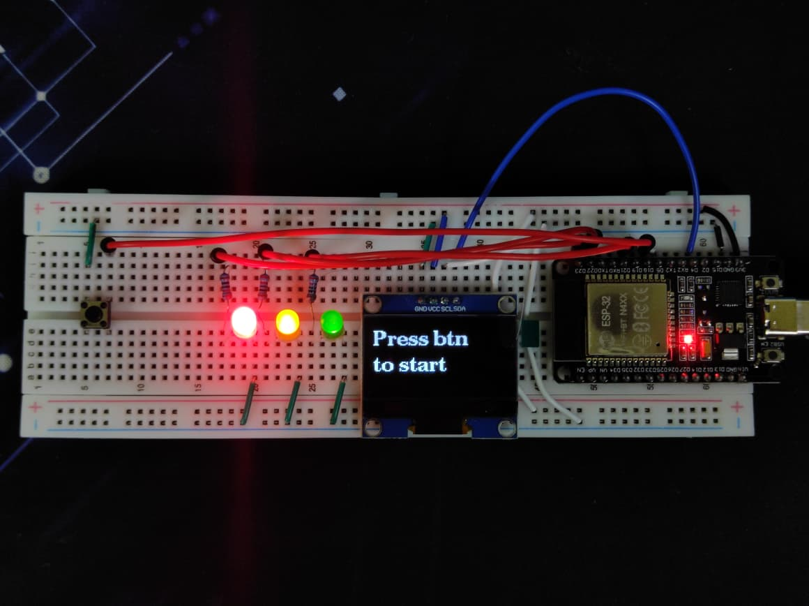
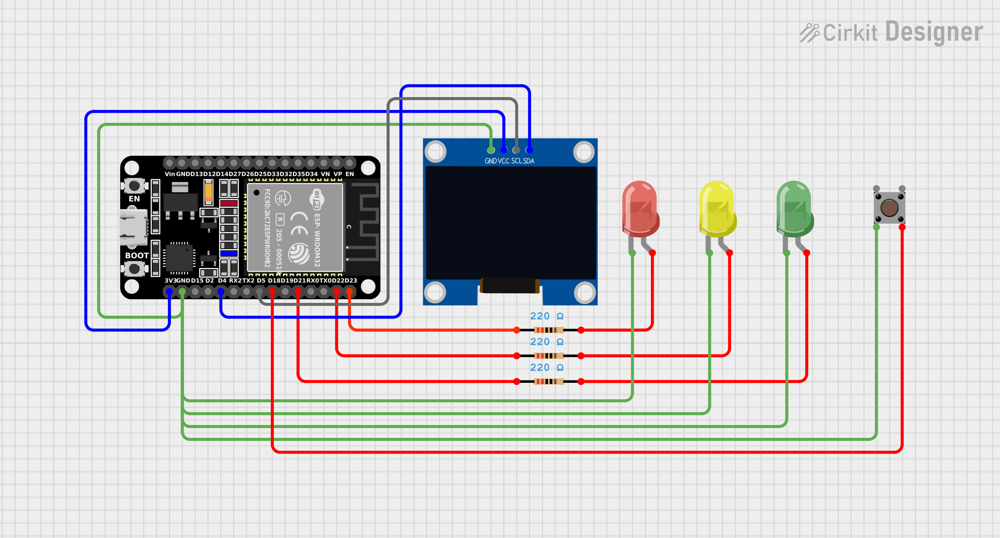

A handheld reaction time tester built on ESP32 with LED countdown and OLED display.

## How it works

Press the button to start. LEDs count down 3→2→1, then all three light up at a random delay. Press the button as fast as you can. Your reaction time shows on the OLED display.

## Hardware

- ESP32
- 3x LEDs (Green, Yellow, Red)
- 1x Push button
- 1.3" SH1106 128x64 OLED display

## Wiring

  
  

| Component  | ESP32 Pin |
| ---------- | --------- |
| Green LED  | GPIO 21   |
| Yellow LED | GPIO 22   |
| Red LED    | GPIO 23   |
| Button     | GPIO 18   |
| OLED SDA   | GPIO 4    |
| OLED SCL   | GPIO 5    |

## Dependencies

- U8g2 (install via Arduino Library Manager)
